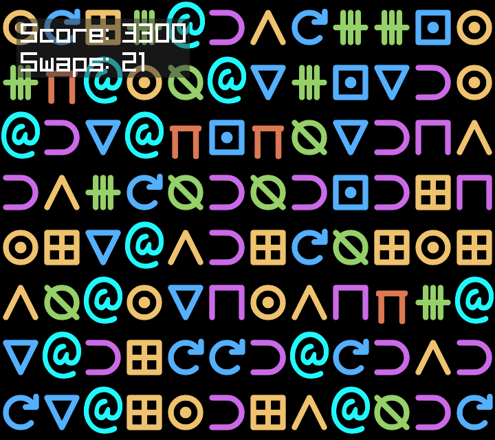

# Bejeweled in Uiua

This is a simple game similar to Bejeweled and Candy Crush Saga.
It is implemented in [Uiua](https://github.com/uiua-lang/uiua)
using the [Iris](https://github.com/marcos-cat/iris) library.



As always Uiua offers a great experience, and Iris is a lovely
higher level wrapper around raylib that abstracts some of the
annoying details.

## Running

To run the game, simply execute the main.ua file with the uiua executable.
```bash
uiua run main.ua
```